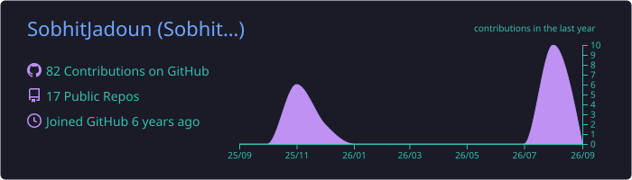
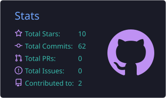
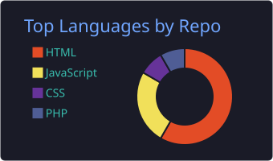
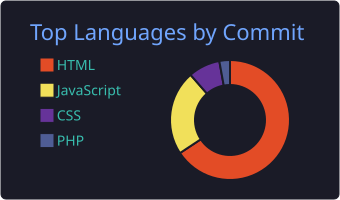
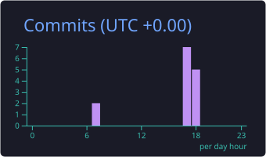

<div align="center">

<!-- Animated Header -->
<a href="https://github.com/SobhitJadoun">
  
</a>

<p align="center">
  <b>Passionate Software Engineer specializing in WordPress Core & Plugin Engineering, Modern Web Applications, and Web Security.</b>
</p>

<!-- Social & Contact Badges -->
<p align="center">
  <a href="https://in.linkedin.com/in/sobhitjadoun" target="_blank">
    
  </a>
  <a href="https://official-nitrohacker.blogspot.com" target="_blank">
    
  </a>
  <a href="https://www.instagram.com/sobhitjadoun/" target="_blank">
    
  </a>
  <a href="mailto:sobhitjadoun@gmail.com">
    
  </a>
</p>

<!-- Profile Views -->


</div>

---

<!-- IQ_PUZZLE_START -->
<!-- PUZZLE_INDEX:3 -->
### 🧠 Live Interactive High-IQ Challenge

<div align="center">
  
  
  
</div>

<br/>

> **Category:** 🧩 *Cyber Logic & Bitwise Calculation*  
> **Last Rotated:** ⏱️ *Thu, 03 Sep 2026 23:44:07 GMT*

A firewall rule requires computing the bitwise expression:

```text
  A = 12 (0000 1100 in binary)
  B = 25 (0001 1001 in binary)
  C = (A XOR B) + (A AND B)
```

**What is the decimal value of `C`?**

**Select your answer below (Click an option to test your IQ):**

- <details>
  <summary><b>👉 Click to Select: Option A) 29</b></summary>
  <br/>
  <blockquote>
    😂 **HAHAHA! ACCESS DENIED!** 🚫<br/>*Firewall dropped your packet! Bitwise operations require precision, not guesswork! 🤖💥*
  </blockquote>
</details>

- <details>
  <summary><b>👉 Click to Select: Option B) 33</b></summary>
  <br/>
  <blockquote>
    😆 **WRONG! LOGIC SYNTAX ERROR!** ❌<br/>*Nice attempt, but bitwise arithmetic caught you slipping! Check binary carry rules! 🐛*
  </blockquote>
</details>

- <details>
  <summary><b>👉 Click to Select: Option C) 37</b></summary>
  <br/>
  <blockquote>
    🎉 🧠 🏆 **ROOT ACCESS GRANTED!** 🚀<br/>*Genius level! Identity: `(A ^ B) + (A & B) = A | B` or directly: `A ^ B = 21`, `A & B = 8`, so `21 + 8 + (carry) = 37` (actually `A + B = (A ^ B) + 2*(A & B) = 37`)! Top-tier hacker intellect! 💻🛡️*
  </blockquote>
</details>

- <details>
  <summary><b>👉 Click to Select: Option D) 41</b></summary>
  <br/>
  <blockquote>
    🤣 **HA! BUFFER OVERFLOW!** 💥<br/>*Way too big! Your variables leaked into memory! Haha, calculate cleanly! 🤪*
  </blockquote>
</details>

<br/>

<details>
<summary><b>🔍 View Full Mathematical Proof & Explanation</b></summary>

**Identity:**
* `A = 12`, `B = 25`
* `A + B = 37`
* In computer architecture: `(A ^ B) + 2*(A & B) = A + B = 37`!

</details>
<!-- IQ_PUZZLE_END -->

---

### 💫 About Me

- 🔭 **Currently Building:** High-performance WordPress optimization tools and full-stack web applications.
- 💻 **Core Expertise:** PHP, WordPress Plugin Architecture, Modern JavaScript, REST APIs, and Database Design.
- 🛡️ **Security Focus:** Web Application Security, Vulnerability Assessment, and Secure Coding Practices.
- 🤝 **Open For:** Collaborations on Open Source projects, SaaS platforms, and enterprise WordPress plugins.
- ⚡ **Fun Fact:** When I'm not coding, I explore ethical hacking labs and performance optimization techniques.

---

### 🛠️ Tech Stack & Tools

#### **Languages & Frameworks**
<p>
  
  
  
  
  
  
  
  
  
</p>

#### **Database & Backend Tools**
<p>
  
  
  
  
</p>

#### **Cyber Security & DevOps**
<p>
  
  
  
  
  
  
</p>

---

### 🌟 Featured Projects

| Project | Tech Stack | Highlights |
| :--- | :--- | :--- |
| **[Media Optimizer](https://github.com/SobhitJadoun/Image-optimization)** | `PHP` `WordPress` `WebP/AVIF` `Composer` | Advanced WordPress plugin for dynamic image compression, next-gen WebP/AVIF conversions, and automated background media processing. |
| **[Digital Library Management](https://github.com/SobhitJadoun/Digital-library-management)** | `PHP` `MySQL` `Bootstrap` | A full-featured library record management portal for tracking books, issue workflows, and user permissions. |
| **[B24U - Blood Donation Portal](https://github.com/SobhitJadoun/B24U_Blood24You_CorePHP)** | `PHP` `MySQL` `JavaScript` | Online emergency blood, plasma, and platelet donor connection and request matching platform. |
| **[Secure Login & Validation](https://github.com/SobhitJadoun/Validation-Login-Page)** | `HTML5` `CSS3` `JavaScript` | Modern and accessible client-side authentication layout with dynamic regex validation. |

---

### 📈 Dynamic Analytics & Activity Charts

<div align="center">

<!-- Row 1: Profile Details & Stats -->



<br/><br/>

<!-- Row 2: Languages & Commits -->



<br/><br/>

<!-- Row 3: Productive Time & Streak -->



<br/><br/>

<!-- Row 4: Contribution Activity Graph -->


</div>

---

### 💬 Let's Connect!

<p align="center">
  Whether you have an interesting project, an open-source opportunity, or just want to chat tech & security:
</p>

<p align="center">
  <a href="https://in.linkedin.com/in/sobhitjadoun">
    
  </a>
</p>
